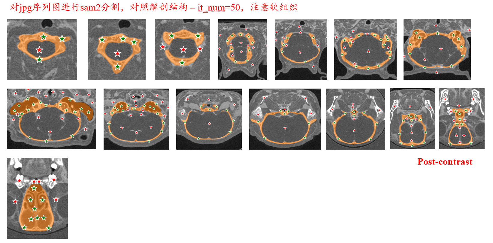

# Pipeline - segment by click 🚀
> -- siyi424, 2025/03/13

只是个小工具啦，方便图像预处理，构建数据集。

## Features ✨
1. 使用 🧠SAM2 预训练权重，支持对图片🖼、视频🎬(.mp4)、序列🗂️(.jpg)进行分割；
2. 使用鼠标点击的方式：
左键点击👆：添加一个点，即增加mask；
右键点击👉：删除（不分割），即减少mask；
3. 可以迅速预览当前 clicked points 的分割效果，
如果不满意，可以在 terminal 里回复 `n` 重新分割；
如果满意，则回复 `y` 保存当前分割结果，并按照当前的 mask 对 it_num 张后续的序列图片进行连续追踪与分割。

## Usage - *eg. micro-CT mouse brain segmentation*

>因为头骨可以认为是刚性物体，且分割时更准确，所以用头骨，而不是大脑内容物进行配准。

1. **Step 1**: 配置环境：
    1. 使用 checkpoints 里的 `download_ckpts.sh` 下载🧠SAM2 的预训练权重；
    2. pip install ... 依赖库。
2. **Step 2**: 选择一个视频🎬(.mp4)或者一个序列🗂️(.jpg)进行分割；
如果是 CT DICOM images，可以使用:
    1.  `1_rename_dcms.py` 重新按照 `0、1、2、... ` 的顺序重命名 dcms 文件；
    2. `2_dicoms_to_frames.py` 将 dcms 转换为 jpgs。
3. **Step 3**: 运行 `3_seg_by_click_final_version.py`，点击待分割区域，保存分割结果；
4. **(Optional Tools)** ⚙️ 其它的工具在 utils 文件夹里，比如：HU 分割、根据 mask 获得 dicom 对应的像素之类的。

**注意，所有的路径、参数，都在config.py里，按需更改**

--- 

## Results 🏁
### pre_contrast 序列分割

### post_contrast 序列分割

